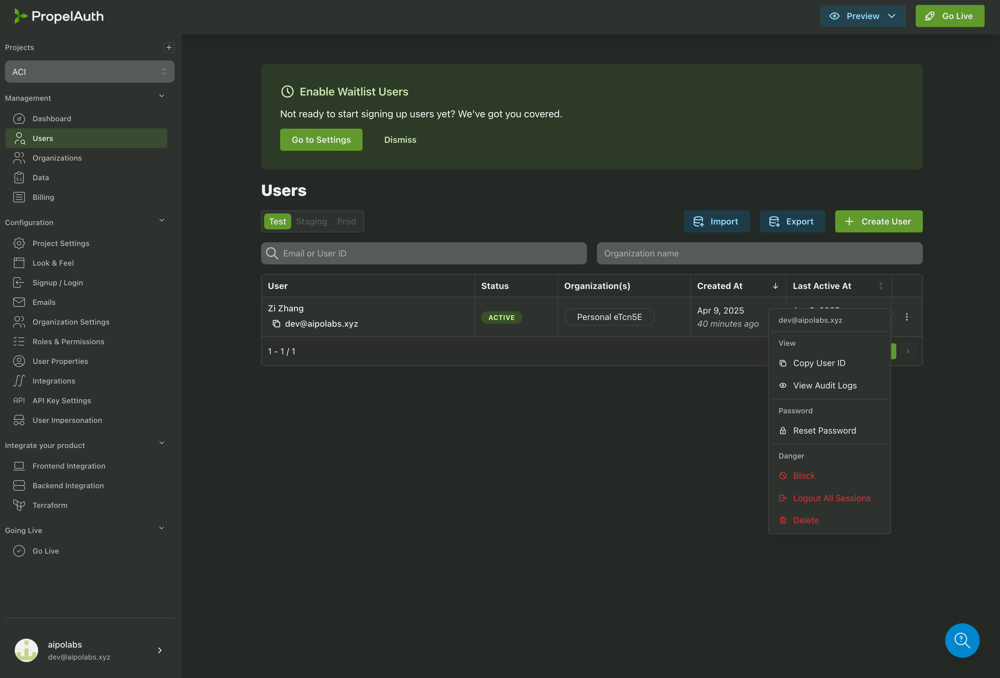
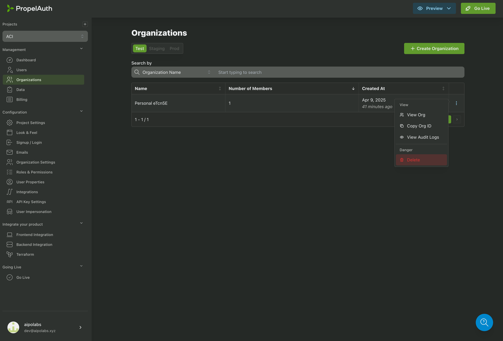
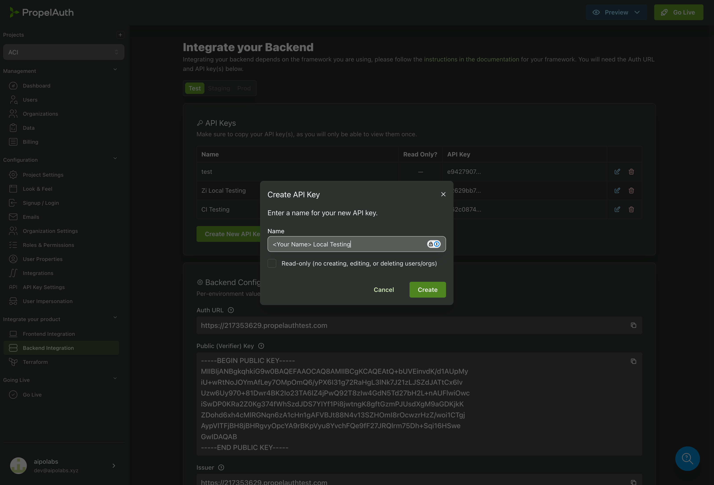
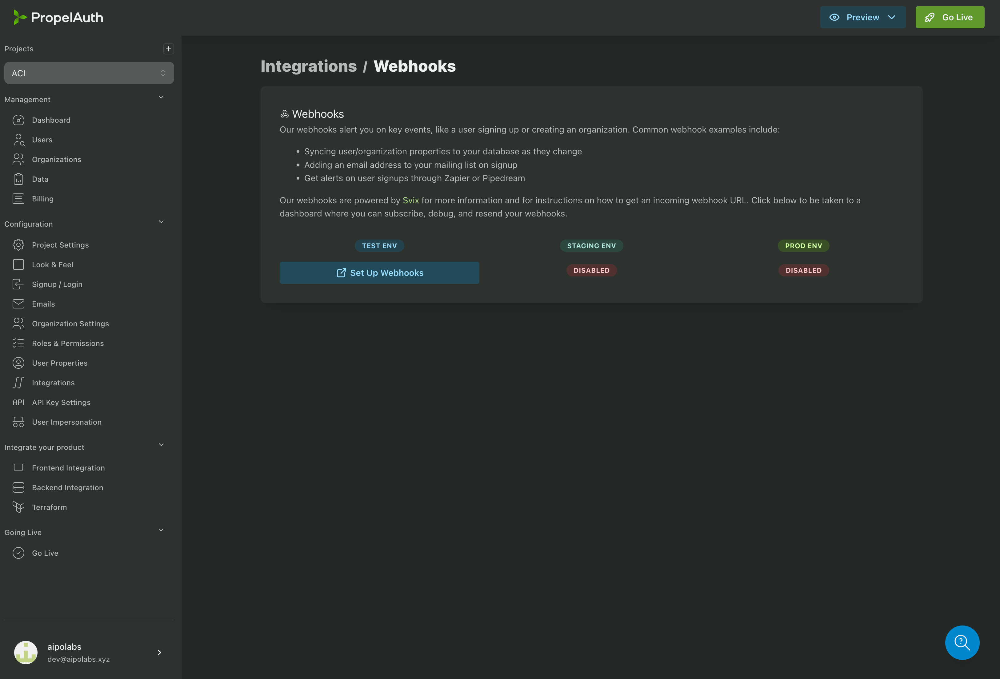
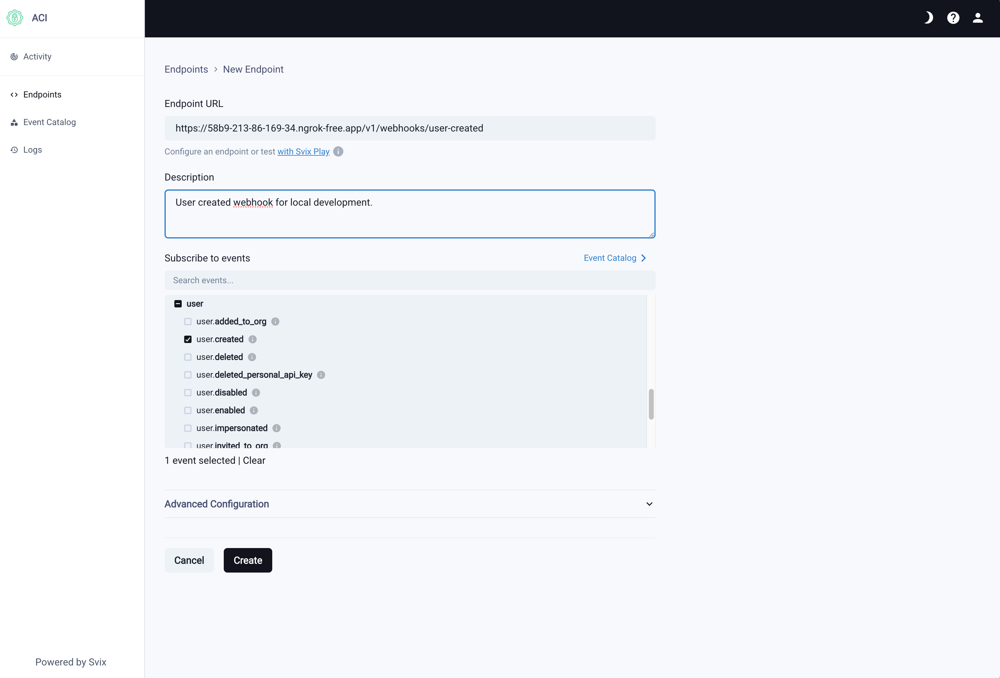
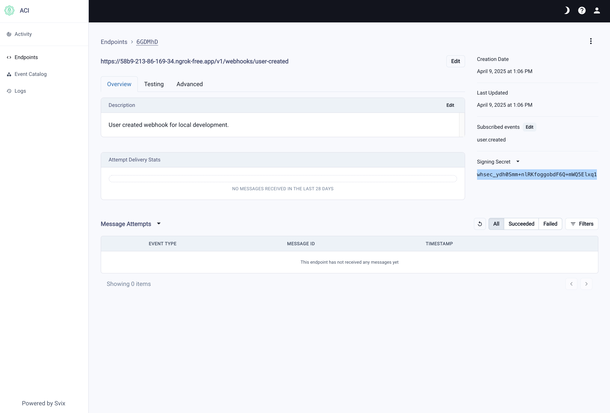

# ACI.dev Backend

[](https://github.com/aipotheosis-labs/aci/actions/workflows/backend.yml)
[](https://opensource.org/licenses/Apache-2.0)

## Overview

The backend component of ACI.dev provides the server infrastructure, API endpoints, database models, and integration libraries that enable over 600+ tool integrations with multi-tenant authentication and granular permissions.

- [ACI.dev Backend](#acidev-backend)
  - [Overview](#overview)
  - [Code Structure](#code-structure)
  - [Development Setup](#development-setup)
    - [Prerequisites](#prerequisites)
    - [Code Style](#code-style)
    - [IDE Configuration](#ide-configuration)
    - [Getting Started](#getting-started)
    - [Running Tests](#running-tests)
  - [Database Management](#database-management)
    - [Working with Migrations](#working-with-migrations)
  - [PropelAuth Webhooks](#propelauth-webhooks)
  - [Stripe Webhooks](#stripe-webhooks)
  - [Admin CLI](#admin-cli)
  - [Contributing](#contributing)
  - [License](#license)

## Code Structure

The backend consists of several main components:

- **Server**: FastAPI application handling API requests, authentication, and tool executions
- **Database**: PostgreSQL with pgvector for vector similarity search
- **CLI**: Command-line interface for local testing and development
- **Common**: Shared code and utilities used across components

## Development Setup

### Prerequisites

- Python 3.12+
- Docker and Docker Compose
- `uv` package manager

### Code Style

We follow strict code quality standards:

- **Formatting & Linting**: We use `ruff` for code formatting and linting
- **Type Checking**: We use `mypy` for static type checking
- **Pre-commit Hooks**: Install with `pre-commit install`

### IDE Configuration

For VS Code users, configure Ruff formatter:

```json
{
    "[python]": {
      "editor.formatOnSave": true,
      "editor.defaultFormatter": "charliermarsh.ruff",
      "editor.codeActionsOnSave": {
        "source.organizeImports.ruff": "always"
      }
    }
}
```

### Getting Started

1. Clone the repository:

   ```bash
   git clone https://github.com/aipotheosis-labs/aci.git
   cd aci/backend
   ```

1. Install dependencies and activate virtual environment:

   ```bash
   uv sync
   source .venv/bin/activate
   ```

1. Install `pre-commit` hooks:

   ```bash
   pre-commit install
   ```

1. Set up environment variables for **local** development:

   ```bash
   cp .env.example .env.local
   ```

   Most sensitive variables and dummy values are already defined in `.env.example`, so you only need to set the following env vars in `.env.local`:

   - `SERVER_OPENAI_API_KEY`: Use your own OpenAI API key
   - `CLI_OPENAI_API_KEY`: Use your own OpenAI API key (can be the same as `SERVER_OPENAI_API_KEY`)

1. Start services with Docker Compose:

   ```bash
   docker compose up --build
   ```

   This will start:
   - `server`: Backend API service
   - `db`: PostgreSQL database
   - `aws`: LocalStack for mocking AWS services
   - `runner`: Container for running commands like pytest, cli commands or scripts

1. Seed the database with sample data:

   ```bash
   docker compose exec runner ./scripts/seed_db.sh
   ```

   The script will seed the database with below dummy data for local end-to-end development.
   - A default project and agent (with an API key)
   - Sample Apps and their functions
     - `Brave Search`
     - `Hacker News`
     - `Gmail` (with dummy OAuth2 credentials)

   The script will output an API key like below that you can use on the swagger UI, SDK, or
   sending HTTP requests to the local backend server directly.

   ```
   {
      'Project Id': '65cf26b9-a919-4008-85de-ecb850c3fc36',
      'Agent Id': '74273ac1-f68e-4314-b8be-fee4a5855d8a',
      'API Key': '88c55e31e817bd2d48aa455e94b61e766fb6e6610c97abe6f724733bf222e3e0'
   }
   ```

   > [!NOTE]
   > If you want to seed the database with all available apps, run the script with the `--all` flag.
   > But you'll have to manually create a secrets file `.app.secrets.json`
   > for each app that has OAuth2 scheme and put the OAuth2 credentials in that file, and the
   > insertion process might take a while.
   > See the example secrets file below for the `GMAIL` app.

   ```bash
   # put this in a file called .app.secrets.json under ./apps/gmail/
   {
      "AIPOLABS_GOOGLE_APP_CLIENT_ID": "<your_google_oauth2_client_id>",
      "AIPOLABS_GOOGLE_APP_CLIENT_SECRET": "<your_google_oauth2_client_secret>"
   }
   ```

1. (Optional) If you want to seed the database with specific `Apps` and `Functions`, use the cli command directly.
   > [!NOTE]
   > Add the `--skip-dry-run` flag to the commands below to actually insert the data into the database.

   ```bash
   # create app (--secrets-file is only needed for apps that have OAuth2 scheme)
   docker compose exec runner python -m aci.cli upsert-app --app-file ./apps/gmail/app.json --secrets-file ./apps/gmail/.app.secrets.json
   # create functions
   docker compose exec runner python -m aci.cli upsert-functions --functions-file ./apps/gmail/functions.json
   ```

1. (Optional) Connect to the database using a GUI client (e.g., `DBeaver`)

   - Parameters for the db connection can be found in the `.env.local` file you created in step 4.

1. Access the API documentation at:

   ```bash
   http://localhost:8000/v1/notforhuman-docs
   ```

1. (Optional) If you are developing the dev portal, follow the instructions on [frontend README](../frontend/README.md) to start the dev portal.

1. (Optional) If you are developing Stripe related billing features, follow the
    [Stripe Webhooks](#stripe-webhooks) section.

### Running Tests

Ensure the `db` service is running and the database is empty (in case you have seeded
the db in `step 6`) before running tests.

> [!NOTE]
> More specifically, if you have run the `seed_db.sh` script already, you need to bring
> down docker compose and bring it up again without running the `seed_db.sh` script this
> time.

Then you can run the test in the `runner` container:

```bash
docker compose exec runner pytest
```

## Database Management

### Working with Migrations

When making changes to database models:

1. Check for detected changes:

   ```bash
   docker compose exec runner alembic check
   ```

2. Generate a migration:

   ```bash
   docker compose exec runner alembic revision --autogenerate -m "description of changes"
   ```

3. Manually review and edit the generated file in `database/alembic/versions/` if needed to add custom changes, e.g.,:
   - pgvector library imports
   - Index creation/deletion
   - Vector extension setup
   - Other database-specific operations

4. Apply the migration (to the local db):

   ```bash
   docker compose exec runner alembic upgrade head
   ```

5. To revert the latest migration:

   ```bash
   docker compose exec runner alembic downgrade -1
   ```

## PropelAuth Webhooks

> [!NOTE]
> This is only needed if you need to develop PropelAuth related features.

If you are developing the dev portal, you would need a real `user` and `org` in the
PropelAuth test environment as well as a default `project` and `agent` in your local db.

You would need to replace a few dummy values with real values in `.env.local`:

- `SERVER_PROPELAUTH_AUTH_URL`
- `SERVER_PROPELAUTH_API_KEY`
- `SERVER_SVIX_SIGNING_SECRET`

Follow the steps here to set up the webhooks so that when you sign up on the PropelAuth
test environment, PropelAuth will notify your local server to create an org in the
PropelAuth test environment for you as well as creating a default project and agent in
the local db.

1. Install and set up ngrok:
   - Follow [ngrok's getting started guide](https://ngrok.com/docs/getting-started/?os=macos)
   - Expose your local server: `ngrok http http://localhost:8000`
   - Copy your public endpoint you just exposed from previous step and create a new endpoint in the [ngrok dashboard](https://dashboard.ngrok.com/endpoints) (e.g. <https://7c4c-2a06-5904-1e06-6a00-ddc6-68ce-ffae-8783.ngrok-free.app>)

1. Configure PropelAuth:
   - Go to your PropelAuth Org [dashboard](https://app.propelauth.com/proj/1b327933-ffbf-4a36-bd05-76cd896b0d56) (the link here is ours, you would need your own)
   - In the Frontend Integrations tab, you can find an Auth URL, copy that URL and use it to replace the dummy value of `SERVER_PROPELAUTH_AUTH_URL` in `.env.local`
   - Go to the **Users** and **Organizations** tabs, delete your previously created user and organization. (Note: only delete the user and org you created previously)
     
     
   - If you don't have a PropelAuth API key already, go to the **Backend Integration** tab and
     create an API key for the test environment, set it as `SERVER_PROPELAUTH_API_KEY`
     in `.env.local`. (If you haven't done so in previous steps)
    
   - Go to the **Integrations** tab on the dashboard, click Webhooks. And click **Set Up Webhooks** for the **TEST ENV**, which will lead you to [Svix endpoints](https://app.svix.com/app_2uuG50X13IEu2cVRRL5fnXOeWWv/endpoints)
    page.
    
   - Click `Add Endpoint`, put `<your_gnrok_public_endpoint>/v1/webhooks/auth/user-created` as the endpoint and subscribe to the `user.created` event. Hit Create.
    
   - Copy the `Signing Secret` of the endpoint and set it as `SERVER_SVIX_SIGNING_SECRET`
    in `.env.local`.
    
   - Go back to the [Getting Started](#getting-started) section step 5 to bring up
     docker compose

1. Change the `NEXT_PUBLIC_AUTH_URL` in the frontend `.env` file to the value of the
   `SERVER_PROPELAUTH_AUTH_URL`

## Stripe Webhooks

> [!NOTE]
> This is only needed if you need to develop the stripe billing features.

1. Download the [Stripe CLI](https://docs.stripe.com/stripe-cli#install)

2. Log into our Stripe Sandbox with the CLI

   ```shell
   stripe login
   ```

3. Set up webhooks with the Stripe CLI and get the webhook signing secret. By default,
all events in the Sandbox will be forwarded to the local webhook endpoint. You can also
use `--event` flag to filter the set of events you want to listen to.

   ```shell
   stripe listen --forward-to localhost:8000/v1/billing/webhook
   > Ready! You are using Stripe API Version [2025-02-24.acacia]. Your webhook signing secret is whsec_3b397734bb0362eac34a9611cc842f4a8cfb8f0e38eccf7ee666b09ac3aeec52
   ```

4. Set the following two env vars in `.env.local`:

   - `SERVER_STRIPE_SECRET_KEY`: get it from the [Stripe dashboard](https://support.stripe.com/questions/what-are-stripe-api-keys-and-how-to-find-them)
   - `SERVER_STRIPE_WEBHOOK_SIGNING_SECRET`: get it from the output of the `stripe
     listen` command you just executed

## Admin CLI

The CLI module is an internal admin tool for ACI to manage apps, functions, users, etc.
For local development, the commands can be executed via the `runner` container.

To see all available commands and their usage, run:

```bash
docker compose exec runner python -m aci.cli --help
```

Example output:

```bash
Usage: python -m aci.cli [OPTIONS] COMMAND [ARGS]...

  AIPO CLI Tool

Options:
  -h, --help  Show this message and exit.

Commands:
  create-agent                   Create an agent in db.
  create-project                 Create a project in db.
  create-random-api-key          Create a random test api key for local...
  delete-app                     Delete an app and all its references...
  fuzzy-test-function-execution  Test function execution with...
  get-app                        Get an app by name from the database.
  rename-app                     Rename an app and update all related...
  update-agent                   Update an existing agent in db.
  upsert-app                     Insert or update an App in the DB from a...
  upsert-functions               Upsert functions in the DB from a JSON...
```

To create a new app, run:

```bash
docker compose exec runner python -m aci.cli create-app --app-file ./apps/brave_search/app.json --secrets-file ./apps/brave_search/.app.secrets.json
```

## Contributing

Please refer to the [Contributing Guide](../CONTRIBUTING.md) for details on making contributions to this project.

## License

This project is licensed under the Apache License 2.0 - see the [LICENSE](../LICENSE) file for details.
